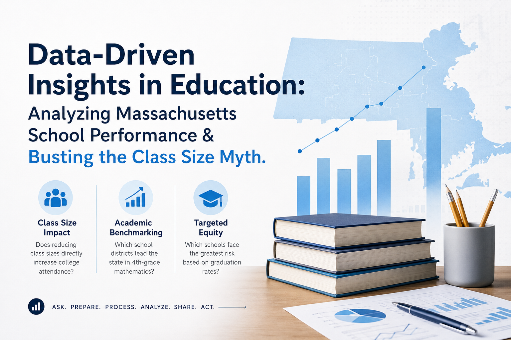
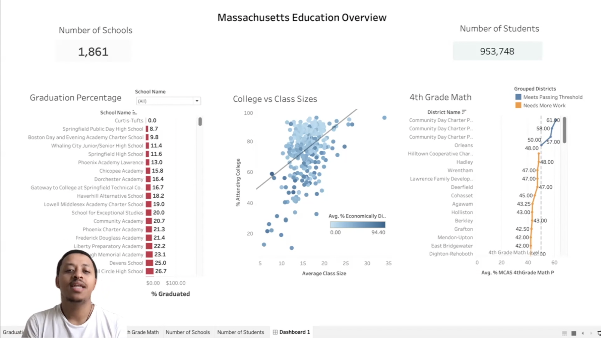
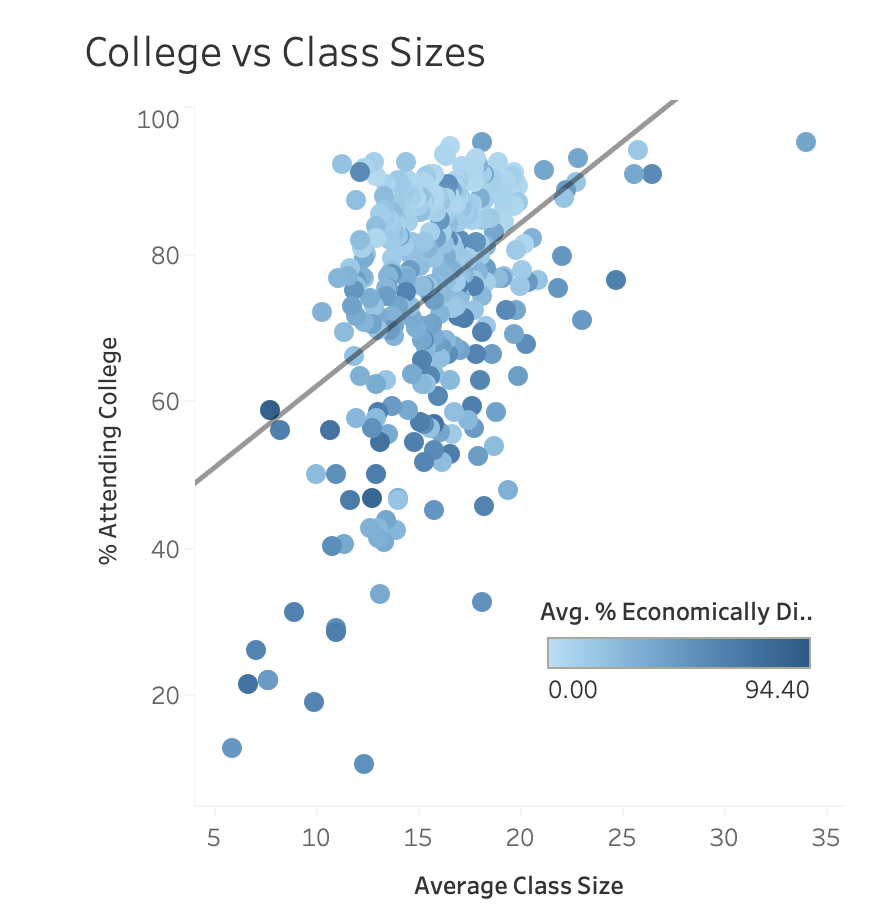
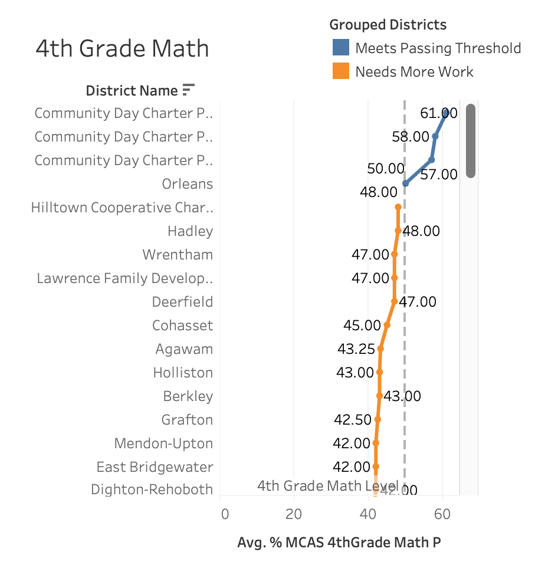
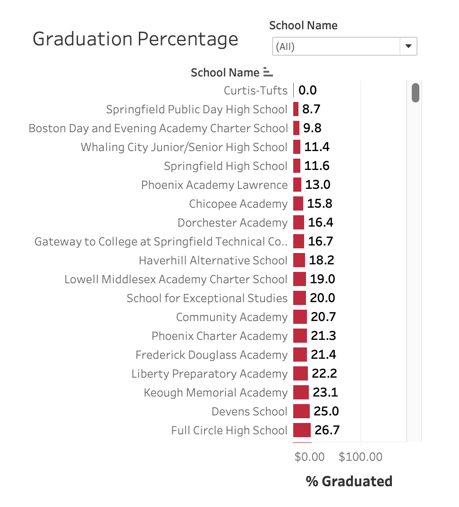

# Data-Driven Insights in Education: Analyzing Massachusetts School Performance & Busting the Class Size Myth

 

## 🎥 Executive Summary & Project Walkthrough

For this data analytics project, I analyzed Massachusetts public education data using the standard data analytics process: Ask, Prepare, Process, Analyze, Share, and Act. The objective was to evaluate the state's education system and answer three key questions:
 
 
  - **Class Size Impact:** Does reducing class sizes directly increase college attendance?
  - **Academic Benchmarking:** Which school districts lead the state in 4th-grade mathematics?
  - **Targeted Equity:** Which schools face the greatest risk based on graduation rates?
 
This project demonstrates how data analytics can be used to move beyond assumptions, uncover meaningful insights, and support evidence-based decision-making in education.
 
 

 

## 1. How Does Class Size Affect College Admission?

 

### 💡 Initial Hypothesis

When visualizing **Average Class Size vs. Percentage Attending College**, the data revealed a counter-intuitive finding: **a slight positive relationship between larger class sizes and college attendance**.

### 🔍 Deep-Dive Nuance & Confounding Variables

Class size alone is not a direct driver of college enrollment. A closer inspection of the data color scale reveals the real underlying factor:

  - **Socioeconomic Status Matters:** Data points representing high percentages of economically disadvantaged students (dark blue dots) are concentrated at lower college attendance levels, regardless of class size.

  - **Resource Concentration:** Larger suburban or high-resource districts often maintain slightly higher average class sizes while offering extensive Advanced Placement (AP) courses, SAT/ACT prep, and dedicated college counseling.

  - **Key Conclusion:** Mandating smaller class sizes without addressing socioeconomic challenges and college readiness resources will yield minimal gains in college enrollment.

 

## 2. Top Math Schools in Massachusetts

To identify institutional excellence in primary mathematics, 4th-grade MCAS performance data was evaluated against a **50% passing threshold** baseline.

### 🏆 Key Performers & Benchmarks

 

**Community Day Charter Public School:** Led the entire state, achieving top MCAS math passing benchmarks of **61.0%**, **58.0%**, and **57.0%**.
**High-Performing Districts:** Richmond-Webster District, Prospect District, and Gateway District consistently surpassed state benchmarks.

**Strategic Impact:** These schools serve as model institutions. Studying their curriculum layout, daily math block scheduling, and teacher coaching frameworks provides a scalable blueprint for underperforming districts statewide.

 

## 3. Schools Facing Critical Challenges

Using **Graduation Percentage** as the primary Key Performance Indicator (KPI) for student retention and school success, the analysis identified schools operating in urgent need of state support.

### ⚠️ High-Priority Intervention List

 

The dataset revealed severe graduation rate disparities in alternative and specialized public academies:

  - **Curtis-Tufts High School:** 0.0% graduation rate
  - **Springfield Public Day High School:** 8.7% graduation rate
  - **Boston Day and Evening Academy Charter School:** 9.8% graduation rate
  - **Whaling City Junior/Senior High School:** 11.4% graduation rate
  - **Springfield High School:** 11.6% graduation rate

 

Note: Many of these institutions serve non-traditional or high-need student populations that require intensive wrap-around services rather than standard standardized testing enforcement alone.

 

## 🎯 Strategic Recommendations for the Superintendent (Act)

Based on the empirical evidence, I recommend four actionable policy steps:

  1. **Pivot Budget Allocation:** Instead of allocating capital strictly to class-size reduction, re-invest funding into college readiness initiatives—such as subsidized SAT/ACT preparation, FAFSA guidance workshops, and peer tutoring.
  2. **Scale Proven Math Frameworks:** Establish a statewide peer-mentorship initiative pairing top math performers (Community Day Charter, Richmond-Webster) with lower-performing districts to share instructional playbooks.
  3. **Deploy Intensive Intervention Resources:** Provide targeted funding for high-need schools (Curtis-Tufts, Springfield Public Day, Boston Day & Evening) to recruit dedicated graduation coaches, attendance officers, and mental health professionals.
  4. **Implement Longitudinal Tracking:** Monitor real-time indicators—such as Chronic Absenteeism and Student Growth Percentile (SGP)—to detect drop-out risk factors early.

 
 

  

